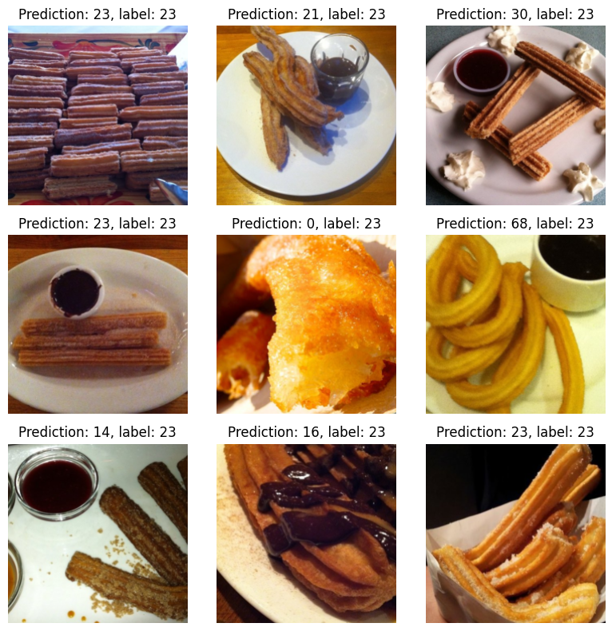

# ViT 모델을 활용한 Food101 이미지 분류


## 🔹 프로젝트 구조

```
datasets/
    food101/
    transform_subset.py
models/
    vit_model.py
utils/
    data_utils.py
    train.py
    test.py
    evaluate.py
    transforms.py
    visualize.py
main.py
requirements.txt
Dockerfile
```
---
## 🔹 실행법 (for Local PC)

### ☝️ Requirements 설치

```
pip install -r requirements.txt
```

### ✌️ 실행

```
python main.py
```
---
## 🔹 도커 실행법 (for Docker User)

### ☝️ 도커 이미지 빌드

```
docker build -t food101-vit .
```

### ✌️ 컨테이너 실행

```
docker run --rm food101-vit
```

---

## 🔹 데이터셋

Food 101  
Food 101 데이터셋은 101개의 클래스로 분류된 음식 이미지 데이터셋으로 총 101,000장의 이미지로 구성되어있습니다. 각 클래스별 1,000장의 이미지로 구성되어 있으며, 다중 분류 모델에 적합합니다.  
  
데이터셋은 별도의 준비 없이, 실행 시 `torchvision` 라이브러리를 통해 자동으로 다운로드됩니다.

---

## 🔹 결과

사전학습된 모델 15 에포크 학습 후, 정확도:

```
Test Accuracy: 65.44%
```

예측 결과 예시:



---
📄 [Project Details](https://portfolio-unoh.site/work3)
06unoh